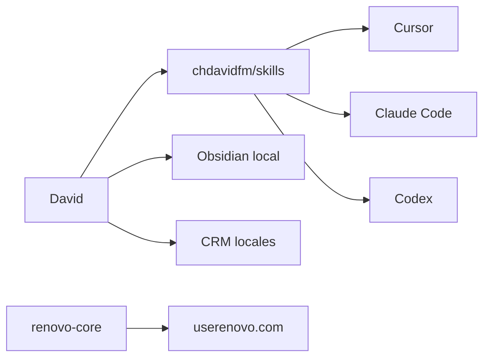

# skills — pack de David

Agent Skills ([agentskills.io](https://agentskills.io/specification)) para **toda la vida**. No es un producto. No es OpenHuman. No hay 90k skills.

[](https://github.com/chdavidfm/skills/actions/workflows/ci.yml)



## Instalar

**Cursor:** clona o copia cada carpeta a `~/.cursor/skills/<name>/`.

**Claude Code / Codex:** apunta al clone; leen `AGENTS.md` + cada `SKILL.md`.

Validar:

```bash
node scripts/validate.mjs
```

## Skills

| Skill | Cuándo |
|---|---|
| [`github`](./github/SKILL.md) | la cuenta entera, un repo nuevo, CI, perfil |
| [`ship`](./ship/SKILL.md) | PR + vigilar CI en **cualquier** repo |
| [`absorb`](./absorb/SKILL.md) | pega un GitHub / skill pack / OS viral |
| [`verify`](./verify/SKILL.md) | “hecho” o “al máximo” sin evidencia |
| [`skill-author`](./skill-author/SKILL.md) | escribir un `SKILL.md` que pase CI |

Memoria (`ingest`, `captura`, `briefing`…) vive en el vault local. Aquí no se duplica.

## Cuenta

| Superficie | URL |
|---|---|
| Vitrina | [github.com/chdavidfm](https://github.com/chdavidfm) |
| Producto | [userenovo.com](https://userenovo.com) |
| Este pack | [chdavidfm/skills](https://github.com/chdavidfm/skills) |
| Lab | [rag-agent-lab](https://github.com/chdavidfm/rag-agent-lab) |

## Qué se extrae de repos ajenos

CI que falla de verdad. `SKILL.md` estándar. Fases de PR (inspeccionar, reusar PR, logs del job rojo). CODEOWNERS, Dependabot, release en `v*` en repos de **código**.

Qué no: su app, su GPL, flotas, auto-fetch de toda la red, segundo wiki.

## Licencia

MIT. Copyright (c) 2026 Christian David Flórez. No copies código GPL de terceros a este repo.
